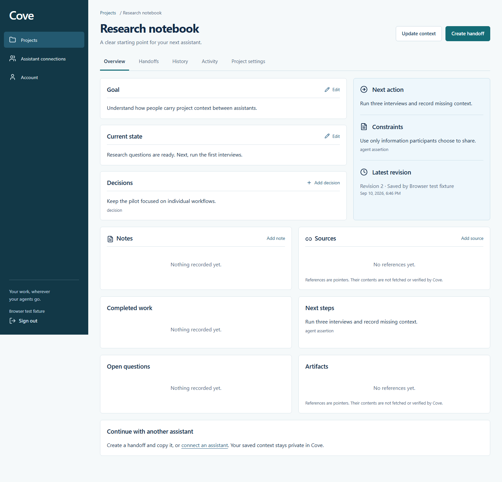

# Cove

**Your work, wherever your agents go.** Switch assistants. Keep your project moving.

Cove is a standalone project-context product for individuals who work across assistants. It stores the goals, constraints, decisions, notes, sources, progress, and next steps you explicitly submit. You can create a private handoff, copy it manually, or retrieve it through a separately authorized assistant.

**Release status: tested local release candidate.** Read [release readiness](docs/release-readiness.md) before putting real customer data into an installation. Public source availability is not a deployed service or a claim of verified assistant host compatibility.

No model API key, subscription billing, private-conversation scraping, automatic source fetching, or external execution is involved. This is not a competition project. Cove was implemented independently; no Kody source, documentation, branding, or architecture was copied.

## Run locally

Prerequisites: Node.js 24, pnpm 11.19.0, Docker with Compose, and Git. Ports 4317, 55439, 1025, and 8025 must be free. The database uses a dedicated named volume; the setup never resets it.

```sh
git clone https://github.com/agammann/cove.git
cd cove
pnpm install --frozen-lockfile
node scripts/setup-env.mjs
docker compose up -d
pnpm db:migrate
pnpm build
pnpm start
```

Open **http://localhost:4317**. Create an account with a password of at least 12 characters. In local development, verification and recovery mail arrives in **http://localhost:8025** (Mailpit); open the verification link there. Local accounts use the same password/session system as production. There is no authentication bypass or seeded administrator.

Use `pnpm dev` for API watch mode after the first build. Rebuild the frontend with `pnpm build`, or run `pnpm dev:web` for the optional Vite frontend preview. OAuth authorization and email links always use the configured canonical origin; use port 4317 for the full acceptance workflow.

## Use Cove

1. Create a private project and record its goal, current state, and next action.
2. Keep working manually, or add `http://localhost:4317/mcp` in a compatible assistant host and approve the selected projects in Cove.
3. Save context. Every update specifies its base revision. Conflicting work is rejected and the browser keeps its open draft.
4. Create a handoff. It pins the current saved revision, not an unsaved draft.
5. Copy the concise or full handoff, or have another authorized assistant retrieve it.
6. Inspect newer changes before continuing. Save the next update and review its author in Activity.

The connection screen provides an exact save prompt. Each handoff provides a project-specific continue prompt. See [prompts and MCP tools](docs/mcp.md).

## Verification commands

```sh
pnpm lint
pnpm typecheck
pnpm test
pnpm build
pnpm exec playwright install chromium
# Keep Cove running on port 4317 for the following test.
pnpm test:browser
node scripts/backup-verify.mjs
node scripts/verify-container.mjs
pnpm scan:secrets
pnpm audit
docker build -t cove:0.1.0 .
```

Integration tests create uniquely named disposable PostgreSQL databases and delete only those databases afterward. Browser tests create clearly labeled test accounts on the local instance, use Mailpit, and exercise account deletion. Failed browser tests may leave their synthetic account for debugging. The recovery test restarts **only this Compose project's database container**; do not run it during active local work.

## Repository map

| Path | Responsibility |
| --- | --- |
| `apps/web` | React screens, forms, accessibility, conflict resolution |
| `apps/api` | Same-origin Fastify API, Better Auth, mail, environment validation |
| `packages/domain` | Shared project authorization and transactional operations |
| `packages/database` | Drizzle schema, reviewed migrations, database connection |
| `packages/mcp` | Official SDK tools and remote transport |
| `packages/shared` | Bounded Zod documents, comparisons, deterministic handoff formatting |
| `tests` | Domain, PostgreSQL, OAuth/SDK and Playwright checks |
| `scripts` | Environment setup, scanning, backup/recovery verification |

## Operating documentation

- [Architecture and data model](docs/architecture.md)
- [Authentication and permissions](docs/authentication.md)
- [MCP tools, prompts, and host matrix](docs/mcp.md)
- [Privacy, retention, and limits](docs/privacy.md)
- [Export and import](docs/portability.md)
- [Deployment, migrations, backups, recovery, and rollback](docs/operations.md)
- [Pilot design](docs/pilot.md)
- [Build checklist](docs/build-checklist.md), [decisions](docs/decisions.md), [verification](docs/verification.md), [release readiness](docs/release-readiness.md)

The local suite passes 14 domain, database, MCP and security tests plus the complete Playwright journey. See the [verification record](docs/verification.md) and [security fixes](docs/security/README.md).



Source is public for review. No open source license has been selected by the owner; public visibility does not itself grant a reuse license. Third party dependencies retain their own licenses.
