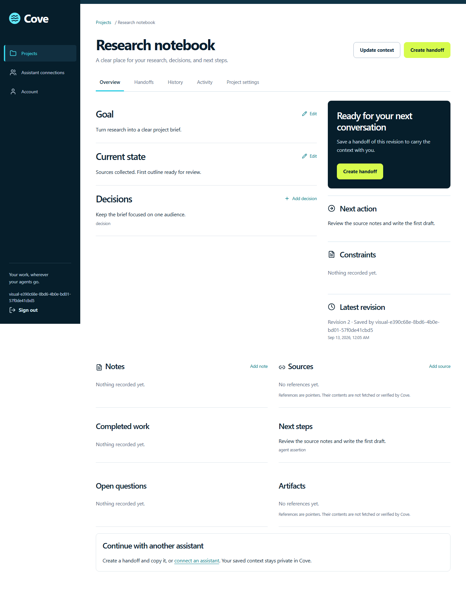

# Cove

**Your work, wherever your agents go.**

Cove keeps your project's goals, decisions, sources, progress, and next steps in one private workspace. Save your context, create a handoff, and continue with another assistant without rebuilding the story from scratch.

**[Open Cove](https://cove-context.alx21.chatgpt.site)** · **[Getting started](docs/getting-started.md)** · **[Documentation](docs/README.md)**

## Start with the website

1. Open Cove and sign in with ChatGPT.
2. Choose **New project** and give your project a name.
3. Record your goal, current state, and next steps, then choose **Save context**.
4. Choose **Create handoff** and copy the concise or full version into your next assistant conversation.

The public website runs the complete app on OpenAI Sites with persistent storage. Your projects require sign in and remain private to your account and the assistant connections you authorize. You do not need to install software or supply a model API key.

## What you can do

* Keep structured context with revision history and comparisons.
* Create handoffs pinned to a saved revision, with a warning when newer context exists.
* Copy a handoff manually or grant an assistant access to selected projects through MCP.
* Export projects as JSON or Markdown and import a Cove JSON export into a new project.
* Review activity, revoke assistant access, archive projects, or delete your data.

Cove stores what you submit. It does not automatically read your assistant conversations or fetch the contents of source links. Copied text remains outside Cove's control.

## Choose your path

| I want to… | Start here |
| --- | --- |
| Use the public app and create my first handoff | [Getting started](docs/getting-started.md) |
| Connect an assistant | [MCP tools, prompts, and compatibility](docs/mcp.md) |
| Run or develop Cove on my computer | [Local development and testing](docs/development.md) |
| Maintain the hosted Sites edition | [Sites architecture and operations](docs/sites.md) |
| Operate my own PostgreSQL installation | [PostgreSQL operations](docs/operations.md) |
| Understand privacy or move my data | [Privacy](docs/privacy.md) and [export/import](docs/portability.md) |

The hosted MCP address is `https://cove-context.alx21.chatgpt.site/api/mcp`. Live ChatGPT and Codex assistant connections remain unverified; the browser workflow and official SDK integration tests have separate verification records. Manual handoff copying works without an assistant connection. See the [compatibility matrix](docs/mcp.md#host-compatibility-matrix).

## For developers

The repository contains two distributions sharing the React frontend. The hosted edition uses a Worker, D1, and ChatGPT sign in. The original local distribution uses Fastify, PostgreSQL, and email/password accounts. Their accounts and data are separate.

Local prerequisites are Node.js 24, pnpm 11.19.0, Git, and Docker with Compose. Follow the [setup guide](docs/development.md) for complete commands, email verification, testing, and troubleshooting. **`pnpm build` builds Sites; `pnpm build:local` builds the local server.**

| Path | Responsibility |
| --- | --- |
| `apps/web` | Shared React frontend |
| `apps/sites` | Hosted Worker, D1 operations, authentication, OAuth, and MCP |
| `apps/api` | Local Fastify API and email authentication |
| `packages/database` and `packages/domain` | PostgreSQL schema, migrations, and transactional operations |
| `packages/mcp` and `packages/shared` | MCP tools, validation, comparisons, and handoff formatting |
| `tests` and `scripts` | Automated checks, setup, builds, and recovery tools |

See [GitHub Actions](https://github.com/agammann/cove/actions/workflows/ci.yml) for current automated results and the [documentation index](docs/README.md) for dated verification records and known limits.

## License

Source is public for review. No open source license has been selected by the owner; public visibility does not itself grant a reuse license. Third party dependencies retain their own licenses.
